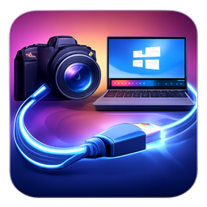
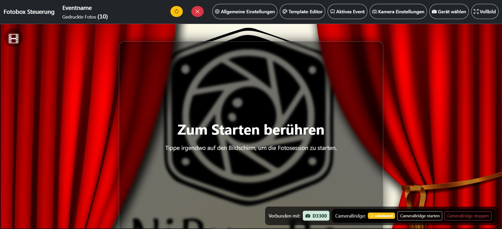
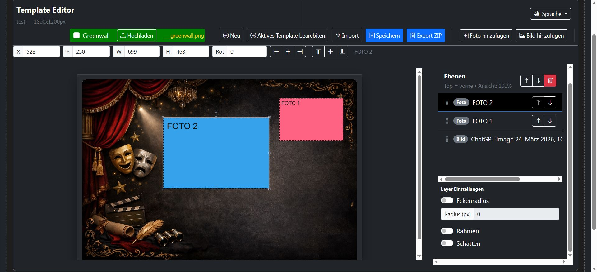
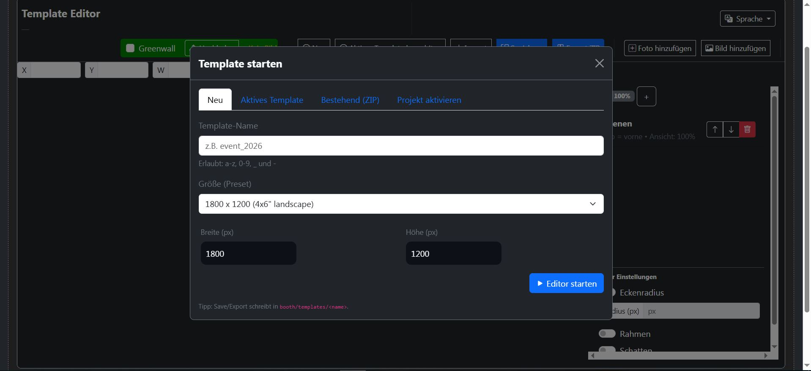
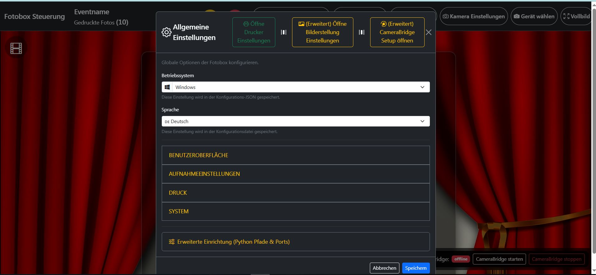
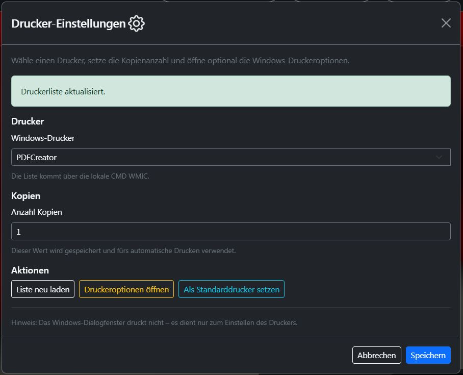
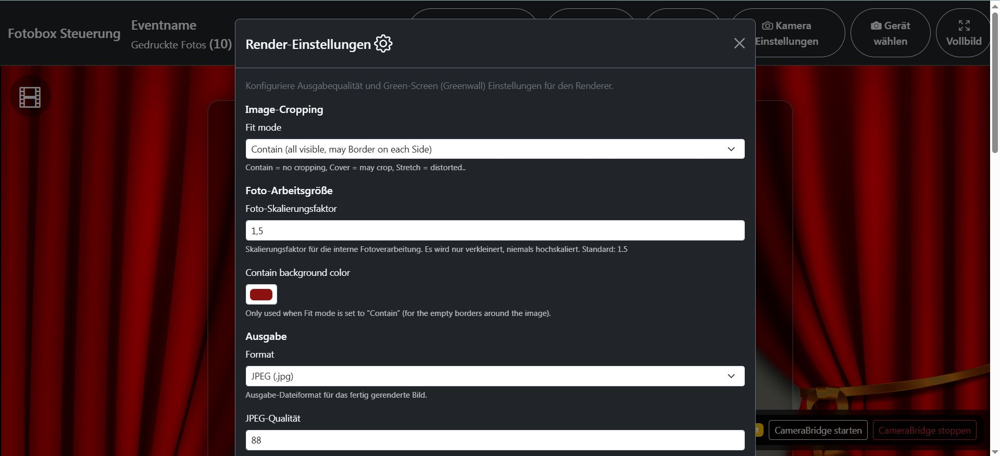
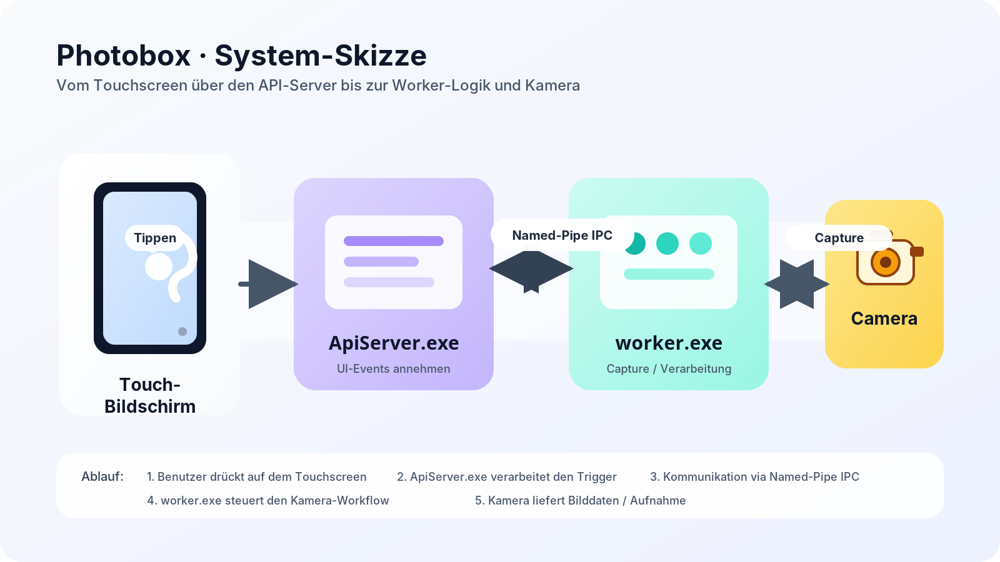
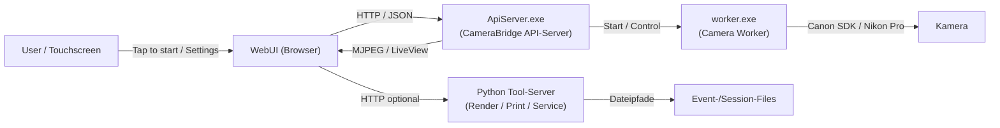
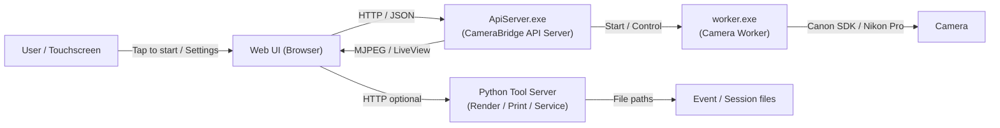

<!-- Language switch -->
[Deutsch](#de) | [English](#en)

# Photobooth Control (Kiosk UI) · CameraBridge · Python Renderer

  

---

## Deutsch

### Screenshots

| | | |
|:---:|:---:|:---:|
|  |  |  |
| Startscreen | Template-Editor | Template-Wizard |
|  |  |  |
| Allgemeine Einstellungen | Druckereinstellungen | Render-Einstellungen |

Browser-basierte Steuerung für eine Fotobox im Kioskbetrieb: **Startscreen**, **Capture-Flow**, **Template-Editor**, **CameraBridge** (LiveView/Capture) und **Python Tool-Server** (Render/Print/Service-Control).

**Linux-Status:** Die Linux-Unterstützung ist bereits **größtenteils vorbereitet**, es müssen aber je nach Deployment noch einzelne Punkte angepasst werden (z. B. Pfade, Service-Start, Drucker-Listing/Integrationen).

**DNP Drucker:** Die Schnittstelle/Integration für **DNP Drucker** ist bereits integriert.

### Architektur (Überblick)

Die WebUI arbeitet mit einem separaten Kamera-Subsystem. Die Kamera wird durch **worker.exe** (Kamera-Worker) gesteuert. Der **ApiServer.exe** stellt die HTTP/JSON-API bereit, übersetzt Requests in **Named-Pipe-IPC** zum Worker und liefert u. a. den **MJPEG-LiveView-Stream**. Die WebUI kommuniziert mit dem API-Server (HTTP/JSON) und nutzt dessen Stream für die Vorschau.

> Kamera-Worker (**worker.exe**) und API-Server (**ApiServer.exe**) sind in einem **eigenen GitHub-Repository** versioniert, weil sie auch unabhängig eingesetzt werden können – die WebUI nutzt sie jedoch als Backend für LiveView/Capture.

Zusätzlich bietet der API-Server:

- **Swagger/OpenAPI-Doku** (z. B. `/docs` bzw. `/openapi`)
- **Health/Autostart** für den Worker (Worker überwachen und bei Bedarf neu starten)
- **CORS/Static Files** je nach Deployment

### Releases & Abhängigkeiten

Dieses Repository enthält primär den **WebUI-Code**. Externe Third-Party-Komponenten (Binaries/Tools) sind **nicht vollständig im Repo eingecheckt**, sondern werden im **Release** mitgeliefert (oder separat installiert).

Typische Release-Inhalte (abhängig vom Paket):

- CameraBridge **API-Server (ApiServer.exe)** + **worker.exe** (Worker)
- Python portable / venv + Image-Rendering Libraries
- optional: Webserver/Reverse Proxy (z. B. Caddy)

Siehe auch: `THIRD_PARTY_NOTICES.md`

### Kamera-Kompatibilität

Eine **breite Kompatibilität** ist vorgesehen, weil die Kamera-Anbindung auf etablierten Komponenten basiert:

- **Canon:** Canon SDK
- **Nikon:** Nikon Pro (bzw. Nikon SDK/Pro-Tethering je nach Kamera)

Dadurch funktionieren auch Modelle, die in anderen Setups oft zicken, häufig stabil – z. B. wird die **Nikon D3300** explizit als Zielmodell berücksichtigt.

### Launcher

Für einen einfachen Betrieb gibt es einen **Launcher**, der vor dem Start typische Checks durchführt, z. B.:

- Pfade/Dateien vorhanden?
- Ports frei / Services erreichbar?
- CameraBridge/API-Server gestartet?
- Python Tool-Server erreichbar?

Ziel: „Ein Button“ für Operatoren – weniger manuelle Fehlersuche im Live-Betrieb.

### Features

- Kiosk-UI mit „Tap to start“
- Geräteauswahl (DSLR/CameraBridge oder Webcam/Virtual Cam)
- Capture-Serie (Countdown → Fotos → Render → optional Print → Finish)
- Template-Editor (Neu, aktives Template, Import ZIP, Projekte, Export ZIP)
- Render-Settings (JPG/PNG, Qualität, DPI, Fit-Mode, Greenwall)
- Drucker-Settings (Windows Printer, Kopien, Standarddrucker)
- Service-Panel (Bridge/Python starten/stoppen/restarten), Statusanzeigen

### Systemvoraussetzungen

Empfohlen (Windows-Setup):

- Windows 10/11
- Installierter Drucker (optional, für Print)
- Kamera/Webcam (DSLR via Bridge oder Webcam/Virtual Cam)
- Optional: Caddy/Reverse Proxy bzw. lokaler Webserver

Linux (vorbereitet, noch Anpassungen nötig):

- Linux Distribution nach Wahl
- Webserver/Reverse Proxy (z. B. Caddy)
- Anpassung von Pfaden/Startskripten/Printer-Handling je nach System

Tools/Services:

- **CameraBridge API-Server** (Standard-Port `8052`)
- **Python Tool-Server** (Standard-Port `8053`, Auth per `X-Api-Key`)

### Quickstart (PC-Installation)

1. Neuestes Release `win64` herunterladen und entpacken.
2. **Windows 11:** Programm freigeben und SmartScreen deaktivieren – `Install_NiBu_CodeSigning_Cert.bat` als Administrator ausführen.
3. **NibLauncher** mit Adminrechten starten.
4. Auf **„Erweitert”** klicken.
5. **„Vollinstallation”** auswählen (optional: Ports vorher anpassen).  
   → Die Installation legt automatisch eine Desktop-Verknüpfung an.
6. Software über die Desktop-Verknüpfung starten.
7. *(Optional)* **Windows Autologin** einrichten, damit Windows nach einem Neustart automatisch einloggt → im Launcher unter „Windows Tweaks” verfügbar.

### Quickstart (Software-Betrieb)

1. Webserver starten (z. B. Caddy / IIS / Apache / eingebetteter Server) und UI öffnen.
2. Unten rechts prüfen, ob **CameraBridge** erreichbar ist.
   - Falls „offline/unknown”: **Start CameraBridge** klicken.
3. **Active Event** setzen (Eventname & Speicherordner, optional Template ZIP).
4. **Select Device**: Devices laden → Kamera auswählen → Speichern.
5. Optional: **Druckereinstellungen** (Drucker + Kopien) und **Auto-Print** prüfen.
6. Zurück zum Startscreen → **„Tap to start”**.

### Konfiguration

Wichtige Dateien (typisch):

- `config/config.json` – globale UI/Flow/Print/System/Python-Pfade
- `config/camera_config.json` – Kamera/LiveView-Settings (ISO/Shutter/WB/FPS/Preview Mirror)
- `config/render_config.json` – Render-Ausgabe (Fit-Mode, JPEG-Qualität, DPI, Greenwall)
- `config/active_event_config.json` – Eventname, Speicherpfad, Print-Limit/Counter, Template-Zuweisung
- `tools/python_portable/server_config.json` – Python-Port + AuthKey + Webroot (abhängig vom Setup)
- `tools/camerabridge/APIServer/ApiServer_settings.json` – Bridge BindAddress/Port/MjpegPath/AuthKey + Worker-Settings (abhängig vom Setup)

### Ports & Security

- **CameraBridge**: Standard `8052`  
  - BindAddress `127.0.0.1` = nur lokal  
  - `0.0.0.0` oder `+` = LAN/WLAN (Firewall-Port freigeben!)
- **Python Tool-Server**: Standard `8053`  
  - AuthKey wird typischerweise als `X-Api-Key` gesendet

⚠️ Der MJPEG/Preview-Stream ist oft **nicht** durch API-Key geschützt. Für LAN-Betrieb unbedingt Netz/Firewall berücksichtigen.

### Template Workflow

- **Neu**: Name + Preset/Custom Größe → Editor starten
- **Aktives Template**: aktuelles Template direkt öffnen
- **Import ZIP**: ZIP mit `template.xml` + Assets importieren
- **Projekt aktivieren**: Projekt aus Liste wählen und aktivieren
- **Export ZIP**: Backup/Transfer

Best Practices:

- Template-Namen nur mit `a-z`, `0-9`, `_`, `-`
- Für Print: JPEG-Qualität 92–95, DPI-Metadaten 300
- Bei Greenscreen: Greenwall im Template aktivieren + Referenzbild nutzen

### Druck (Windows)

- Druckerliste kommt typischerweise über lokale Windows-Abfrage (z. B. WMIC/Printer API).
- Kopien über `printer.printerCount` (1–20).
- „Als Standarddrucker setzen“ hilft, wenn Treiber/Tools den Windows-Default verwenden.

### Development / Struktur (typisch)

- `index.html` / UI-HTML
- `js/` (Frontend-Logik, Capture Flow, Bridge API Client)
- `api/` (z. B. PHP-Endpunkte: Config-Read/Write, Template-Info, Session-Snapshot, Uploads)
- `config/` (JSON-Konfigs)
- `tools/` (CameraBridge, Python portable, Hilfstools)
- `templates/` (Template-Projekte, `template.xml` + Assets)
- `Logo/Logo.png` (Repository Logo)

### Lizenz

Dieses Projekt ist lizenziert unter **GNU AGPL-3.0-or-later**.  
Siehe Datei `LICENSE`.

### Third-Party / Danksagung

Großes Danke an diese Projekte (und deren Maintainer/Contributor):

- digiCamControl – https://github.com/dukus/digiCamControl  
- Fabric.js – https://fabricjs.com/  
- Bootstrap – https://getbootstrap.com/  
- Caddy – https://caddyserver.com/  
- PHP – https://www.php.net/  
- Python – https://www.python.org/

Zusätzliche Hinweise zu Third-Party-Files (u. a. `align_guidlines.js`, `centering_guidlines.js`, `crypto.js`) findest du in `THIRD_PARTY_NOTICES.md`.

---

## English

### Screenshots

| | | |
|:---:|:---:|:---:|
|  |  |  |
| Start screen | Template editor | Template wizard |
|  |  |  |
| General settings | Printer settings | Render settings |

Browser-based controller for a kiosk-style photo booth: **start screen**, **capture flow**, **template editor**, **CameraBridge** (live view/capture) and a **Python tool server** (render/print/service control).

**Linux status:** Linux support is **mostly prepared**, but depending on your deployment you still need to adjust a few things (e.g., paths, service startup, printer listing/integrations).

**DNP printers:** The interface/integration for **DNP printers** is already integrated.

### Architecture (overview)

The Web UI uses a separate camera subsystem. The camera is controlled by **worker.exe** (camera worker). **ApiServer.exe** provides the HTTP/JSON API, translates requests to the worker via **named-pipe IPC**, and exposes the **MJPEG live view stream**. The Web UI talks to the API server over HTTP/JSON and uses the stream for preview.

> The camera worker (**worker.exe**) and the API server (**ApiServer.exe**) live in a **separate GitHub repository** because they can be used standalone as well — the Web UI integrates with them as its capture backend.

Additionally, the API server provides:

- **Swagger/OpenAPI docs** (e.g. `/docs` and `/openapi`)
- **Worker health & auto-start** (monitor the worker and restart when needed)
- **CORS / static files** depending on the deployment

### Releases & dependencies

This repository mainly contains the **Web UI code**. External third-party components (binaries/tools) are **not fully committed into the repo** and are shipped as part of the **Release** (or installed separately).

Typical release contents (depending on the package):

- CameraBridge **API Server (ApiServer.exe)** + **worker.exe** (worker)
- Python portable / venv + image rendering libraries
- optional: web server / reverse proxy (e.g., Caddy)

See also: `THIRD_PARTY_NOTICES.md`

### Camera compatibility

The goal is **broad compatibility** by relying on established camera integration layers:

- **Canon:** Canon SDK
- **Nikon:** Nikon Pro (or Nikon SDK / pro tethering depending on the model)

This helps even with models that often fail in other setups — **Nikon D3300** is explicitly considered as a target model.

### Launcher

A dedicated **Launcher** is included to make operation easy by running pre-flight checks, for example:

- are required paths/files present?
- are ports free / services reachable?
- is CameraBridge / API server started?
- is the Python tool server reachable?

Goal: “one button” for operators — fewer manual troubleshooting steps during events.

### Features

- Kiosk UI with “Tap to start”
- Device selection (DSLR/CameraBridge or webcam/virtual cam)
- Capture series (countdown → photos → render → optional print → finish)
- Template editor (new, active template, ZIP import, projects, ZIP export)
- Render settings (JPG/PNG, quality, DPI, fit mode, greenwall)
- Printer settings (Windows printer, copies, default printer)
- Service panel (start/stop/restart Bridge/Python), status indicators

### Requirements

Recommended (Windows):

- Windows 10/11
- Installed printer (optional)
- Camera/webcam (DSLR via Bridge or webcam/virtual cam)
- Optional: Caddy / reverse proxy / local web server

Linux (prepared, still needs adjustments):

- Your preferred Linux distribution
- Web server / reverse proxy (e.g., Caddy)
- Adjust paths/start scripts/printer handling depending on the system

Tools/Services:

- **CameraBridge API server** (default port `8052`)
- **Python tool server** (default port `8053`, auth via `X-Api-Key`)

### Quickstart (PC Installation)

1. Download the latest `win64` release and extract it.
2. **Windows 11:** Unblock the program and disable SmartScreen – run `Install_NiBu_CodeSigning_Cert.bat` as Administrator.
3. Launch **NibLauncher** with Administrator rights.
4. Click **”Advanced”**.
5. Select **”Full Installation”** (optionally adjust ports first).  
   → The installer automatically creates a Desktop shortcut.
6. Start the software via the Desktop shortcut.
7. *(Optional)* Set up **Windows Autologin** so Windows logs in automatically after a reboot → available in the Launcher under “Windows Tweaks”.

### Quickstart (Running the Software)

1. Start your web server and open the UI.
2. Make sure **CameraBridge** is reachable (bottom right).
   - If “offline/unknown”: click **Start CameraBridge**.
3. Set **Active Event** (event name & storage folder, optional template ZIP).
4. **Select Device**: load devices → pick camera → save.
5. Optional: configure **Printer settings** (printer + copies) and verify **Auto-Print**.
6. Back to the start screen → **”Tap to start”**.

### Configuration

Common files:

- `config/config.json`
- `config/camera_config.json`
- `config/render_config.json`
- `config/active_event_config.json`
- `tools/python_portable/server_config.json`
- `tools/camerabridge/APIServer/ApiServer_settings.json`

### Ports & Security

- **CameraBridge**: default `8052`  
  - `127.0.0.1` = local only  
  - `0.0.0.0` or `+` = LAN/Wi‑Fi (open firewall port!)
- **Python tool server**: default `8053`  
  - Auth typically via `X-Api-Key`

⚠️ MJPEG/preview streams are often **not** protected by the API key. Consider network/firewall rules for LAN setups.

### License

Licensed under **GNU AGPL-3.0-or-later**. See `LICENSE`.

### Third-Party / Credits

Thanks to these projects:

- digiCamControl – https://github.com/dukus/digiCamControl  
- Fabric.js – https://fabricjs.com/  
- Bootstrap – https://getbootstrap.com/  
- Caddy – https://caddyserver.com/  
- PHP – https://www.php.net/  
- Python – https://www.python.org/

For additional third-party notes (incl. `align_guidlines.js`, `centering_guidlines.js`, `crypto.js`) see `THIRD_PARTY_NOTICES.md`.
