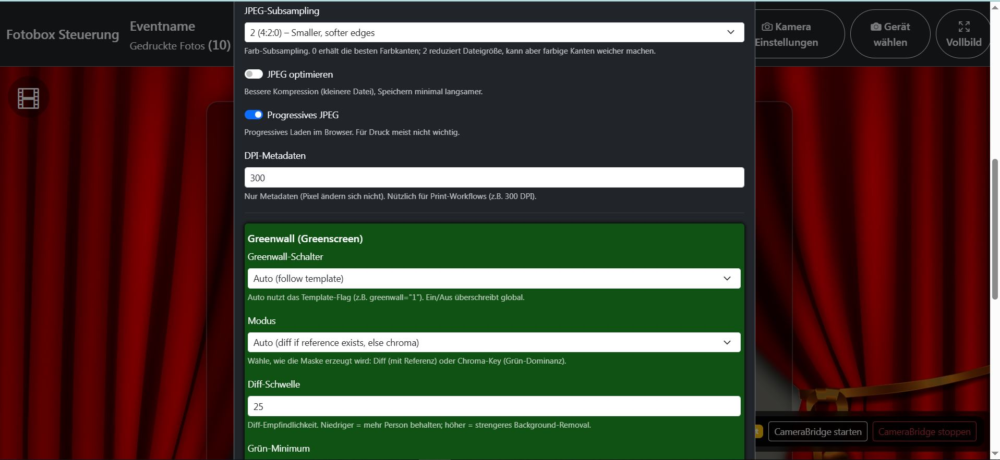
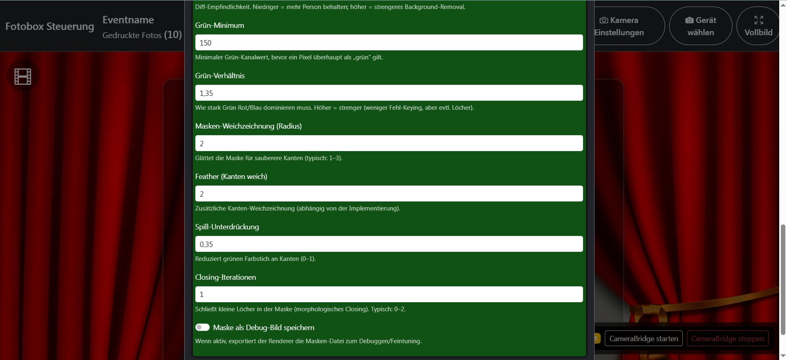

# Image Render Einstellungen {#render-settings}

## Beschreibung

In diesem Bereich konfigurierst du die **Ausgabequalität** des Renderers sowie die **Green-Screen (Greenwall)**-Parameter.  
Die Werte werden in `config/render_config.json` gespeichert (Formular: `data-json-file="config/render_config.json"`).

## Image-Cropping

Diese Einstellungen steuern, wie Fotos in die vorgesehenen Bild-Platzhalter des Templates eingepasst werden.

- **Fit mode**
  - **JSON:** `render.resize_mode`
  - **Default:** `cover`
  - **Werte:**
    - `contain` – **Alles sichtbar**, ggf. Ränder (letterboxing) an den Seiten/oben/unten.
    - `cover` – **Füllt den Platzhalter**, kann dabei **beschneiden** (cropping).
    - `stretch` – **Streckt** auf Platzhaltergröße, kein Cropping, aber **Seitenverhältnis kann verzerren**.
  - **Wirkung:** Bestimmt das „Fit“-Verhalten beim Skalieren der Fotos für das Template.

Praxis-Tipp:

- Für klassische Photobooth-Templates ist `cover` oft am besten (Platzhalter wird gefüllt).
- Für Logos/Text oder wenn nichts abgeschnitten werden darf, ist `contain` sinnvoll.

- **Contain background color**
  - **JSON:** `render.contain_bg`
  - **Typ:** Color (`#RRGGBB`)
  - **Default:** `#000000`
  - **Wirkung:** Farbe der „leeren“ Ränder, **nur wenn** `render.resize_mode = contain`.

## Ausgabe

Diese Einstellungen bestimmen Dateiformat, Kompression und Metadaten der gerenderten Ausgabe.

- **Format**
  - **JSON:** `output.format`
  - **Default:** `jpg`
  - **Werte:** `jpg`, `png`
  - **Wirkung:**
    - `jpg` ist typisch für Print (kompakt, schnell).
    - `png` ist verlustfrei, aber größer und oft langsamer.

- **JPEG-Qualität**
  - **JSON:** `output.jpeg_quality`
  - **Range:** 1–100
  - **Default:** 94
  - **Wirkung:** Höher = bessere Qualität, größere Datei.
  - **Empfehlung:** Für Print meist **92–95**.

- **JPEG-Subsampling**
  - **JSON:** `output.jpeg_subsampling`
  - **Default:** 0
  - **Werte:**
    - `0` (4:4:4) – beste Farbkanten (gut für Logos/Text)
    - `1` (4:2:2) – ausgewogen
    - `2` (4:2:0) – kleinere Datei, weichere Farbkanten
  - **Wirkung:** Reduziert Farbauflösung zur Kompression. Niedriger = bessere Kanten, höher = kleinere Datei.

- **JPEG optimieren**
  - **JSON:** `output.jpeg_optimize`
  - **Typ:** bool
  - **Default:** `true`
  - **Wirkung:** Optimiert die JPEG-Kompression (kleinere Datei), Speichern minimal langsamer.

- **Progressives JPEG**
  - **JSON:** `output.jpeg_progressive`
  - **Typ:** bool
  - **Default:** `true`
  - **Wirkung:** Ermöglicht progressives Laden im Browser (nützlich für Web-Preview). Für Druck meist nebensächlich.

- **DPI-Metadaten**
  - **JSON:** `output.dpi`
  - **Range:** 72–1200
  - **Default:** 300
  - **Wirkung:** Setzt **nur Metadaten** (die Pixelanzahl bleibt gleich). Hilfreich für Print-Workflows (z. B. 300 DPI).

## Greenwall

Greenwall entspricht dem **Greenscreen-Keying**. Hier werden Aktivierung, Modus und Tuning-Parameter definiert.

- **Greenwall-Schalter**
  - **JSON:** `greenwall.switch`
  - **Default:** `auto`
  - **Werte:**
    - `auto` – folgt dem Template-Flag (z. B. `greenwall="1"` in Template/Layers)
    - `on` – Greenwall immer aktiv (erzwingt Keying)
    - `off` – Greenwall immer aus (ignoriert Template)
  - **Wirkung:** Globale Ein/Aus/Auto-Logik.

- **Modus**
  - **JSON:** `greenwall.mode`
  - **Default:** `auto`
  - **Werte:**
    - `auto` – nutzt **Diff**, wenn Referenz existiert, sonst **Chroma**
    - `diff` – Referenzvergleich (Background-Referenzbild)
    - `chroma` – Chroma-Keying über Grün-Dominanz
  - **Wirkung:** Bestimmt, wie die Maske erzeugt wird.

## Greenwall Tuning

Diese Werte beeinflussen Qualität und Stabilität der Maske.

- **Diff-Schwelle**
  - **JSON:** `greenwall.diff_threshold`
  - **Range:** 0–255
  - **Default:** 25
  - **Wirkung:** Empfindlichkeit beim Referenzvergleich.
    - niedriger = mehr wird als „Person“ behalten (mehr Rauschen möglich)
    - höher = strengeres Background-Removal (Risiko: Teile der Person verschwinden)

- **Grün-Minimum**
  - **JSON:** `greenwall.green_min`
  - **Range:** 0–255
  - **Default:** 150
  - **Wirkung:** Minimaler Grünkanalwert, bevor ein Pixel überhaupt als „grün“ betrachtet wird.

- **Grün-Verhältnis**
  - **JSON:** `greenwall.green_ratio`
  - **Range:** 1–5 (float)
  - **Default:** 1.35
  - **Wirkung:** Wie stark Grün Rot/Blau dominieren muss.
    - höher = strenger (weniger Fehl-Keying), aber Risiko von „Löchern“ (z. B. in Kleidung/Reflexen)

- **Masken-Weichzeichnung (Radius)**
  - **JSON:** `greenwall.blur_radius`
  - **Range:** 0–20
  - **Default:** 2
  - **Wirkung:** Glättet die Maske für sauberere Kanten (typisch 1–3).

- **Feather (Kanten weich)**
  - **JSON:** `greenwall.feather`
  - **Range:** 0–50
  - **Default:** 2
  - **Wirkung:** Zusätzliche Kantenweichzeichnung (abhängig von der Renderer-Implementierung).

- **Spill-Unterdrückung**
  - **JSON:** `greenwall.spill_suppression`
  - **Range:** 0–1 (float)
  - **Default:** 0.35
  - **Wirkung:** Reduziert grünen Farbstich an Kanten (typisch bei Greenscreen-Beleuchtung).

- **Closing-Iterationen**
  - **JSON:** `greenwall.close_iter`
  - **Range:** 0–10
  - **Default:** 1
  - **Wirkung:** Morphologisches „Closing“, um kleine Löcher in der Maske zu schließen (typisch 0–2).

- **Maske als Debug-Bild speichern**
  - **JSON:** `greenwall.write_mask_debug`
  - **Typ:** bool
  - **Default:** `false`
  - **Wirkung:** Exportiert die Masken-Datei zusätzlich als Debug-Ausgabe (hilfreich fürs Feintuning).

## Troubleshooting

- **Gesichter/Haare haben Löcher**
  - `green_ratio` etwas senken oder `diff_threshold` senken (je nach Modus).
  - `close_iter` leicht erhöhen (z. B. 1 → 2) und `blur_radius` moderat halten.

- **Grüne Ränder („Spill“) an Kanten**
  - `spill_suppression` erhöhen (z. B. 0.35 → 0.45).

- **Zu viel Hintergrund bleibt übrig**
  - `diff_threshold` erhöhen oder `green_ratio` erhöhen (strenger).

- **Zu viel wird weggekeyed**
  - `diff_threshold` senken oder `green_min` erhöhen/senken je nach Licht – hier hilft meist Testen mit `write_mask_debug=true`.
