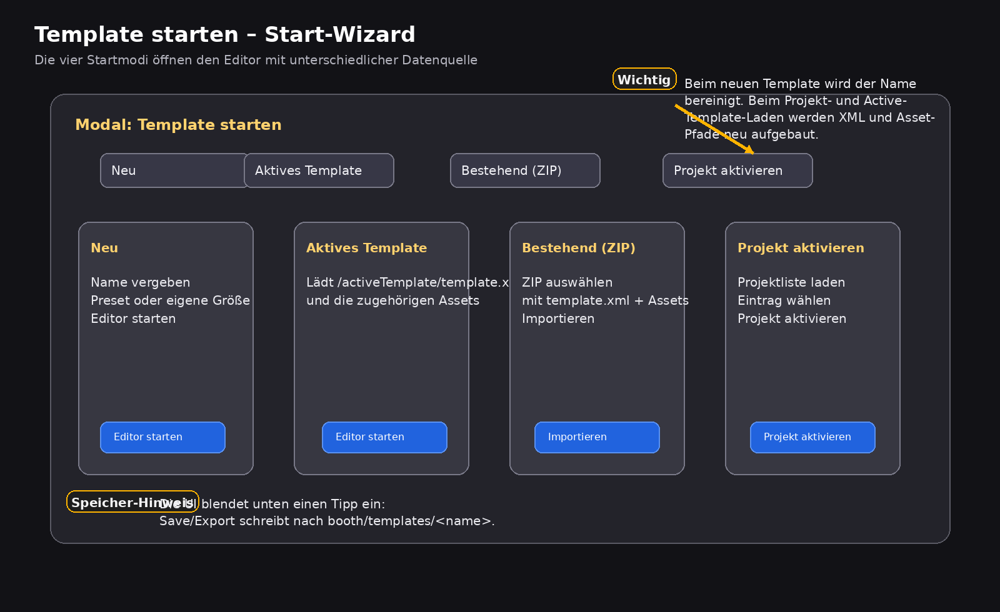

# Template Editor {#template-editor}

Der **Template Editor** startet den eigentlichen Bearbeitungsmodus für Layout-Templates.  
Über den Start-Wizard legst du fest, **woher das Template kommt**: neu anlegen, das feste `activeTemplate` laden, ein ZIP importieren oder ein vorhandenes Projekt aktivieren.

> Oben siehst du den **Original-Screenshot** aus deinem Editor. Darunter folgt die **vereinfachte Übersichtsgrafik**, damit die Bereiche im Handbuch leichter erklärt werden können.

## Was der Start-Wizard macht

Der Wizard (`#teModal`) öffnet sich beim Start automatisch. Er enthält vier Tabs:

- **Neu**
- **Aktives Template**
- **Bestehend (ZIP)**
- **Projekt aktivieren**

Erst nach einem Klick auf den jeweiligen Start-Button wird der Editor mit einem konkreten Projekt geladen.

---

## Tab „Neu“

Hier legst du ein neues Template an.

## Template-Name

- Feld: `#newName`
- Erlaubt sind laut UI: `a-z`, `0-9`, `_` und `-`
- Leerzeichen und ungültige Zeichen werden clientseitig bereinigt
- Vor dem Start prüft der Editor, ob der Name bereits als Projekt existiert

**Empfehlung:**  
Verwende sprechende Namen wie `event_2026`, `wedding_2026` oder `summer_collage`.

## Größe (Preset)

- Feld: `#presetSize`
- Voreinstellungen:
  - `1800 x 1200` – 4x6 Landscape
  - `1200 x 1800` – 4x6 Portrait
  - `2400 x 3600` – 8x12 Portrait
  - `Custom`

Wenn du ein Preset auswählst, setzt der Wizard automatisch `Breite` und `Höhe`.

## Breite und Höhe

- `#newW`
- `#newH`

Diese Werte definieren die tatsächliche Canvas-Größe des Templates in Pixeln.  
Beide Werte müssen gültig sein und mindestens sinnvoll groß gewählt werden.

## Editor starten

- Button: `#btnCreateNew`

Beim Klick passiert Folgendes:

1. Name und Maße werden geprüft.
2. Der Projektname wird als aktives Projekt gesetzt.
3. Der Editor wird mit der neuen Größe initialisiert.
4. Die Arbeitsfläche wird auf „Fit to Screen“ vorbereitet.

**Typischer Einsatz:**  
Wenn du ein komplett neues Layout oder eine neue Collage-Vorlage aufbaust.

---

## Tab „Aktives Template“

Dieser Tab lädt das fest definierte aktive Template.

- Button: `#btnLoadActiveTemplate`

Der Editor lädt dabei:

- XML: `/activeTemplate/template.xml`
- Basis-Pfad für Assets: `/activeTemplate/`

**Wann du diesen Modus verwendest:**

- wenn du direkt das aktuell produktive Template nachbearbeiten willst
- wenn eine Event- oder Booth-Konfiguration bereits auf das aktive Template zeigt
- für schnelle Korrekturen an einem bestehenden Live-Layout

**Praxis-Hinweis:**  
Dieser Modus erzeugt **kein neues Projekt**, sondern arbeitet auf dem vorgesehenen `activeTemplate`.

---

## Tab „Bestehend (ZIP)“

Mit diesem Modus importierst du ein vorhandenes Template-Paket.

## ZIP auswählen

- Feld: `#fileImportZip`
- Accept: `.zip`

Erwartet wird ein ZIP mit:

- `template.xml`
- zugehörigen Bildern und Assets

## Importieren

- Button: `#btnDoImport`

Nach dem Import wird der Editor direkt mit den Daten aus dem ZIP befüllt.

**Gut zu wissen:**

- Bild-Layer werden aus ihren gespeicherten Asset-Pfaden geladen.
- Die Ebenen-Reihenfolge wird nach dem Import wiederhergestellt.
- Gespeicherte Layer-Styles wie Radius, Rahmen und Schatten werden mit übernommen.

**Typischer Einsatz:**  
Wenn du ein Template von einer anderen Installation, aus einem Backup oder aus einem Archiv übernehmen möchtest.

---

## Tab „Projekt aktivieren“

Hier wählst du ein vorhandenes Projekt aus der Projektliste.

## Projektliste

- Select: `#teProjectSelect`
- Aktualisieren: `#teBtnRefreshProjects`
- Aktivieren: `#teBtnOpenProject`

Beim Öffnen des Modals oder per Klick auf **Aktualisieren** wird die Projektliste neu geladen.  
Der Button **Projekt aktivieren** bleibt deaktiviert, bis ein Eintrag ausgewählt wurde.

## Was beim Aktivieren passiert

Nach der Auswahl eines Projekts lädt der Editor:

- die `template.xml` des Projekts
- den zugehörigen Basis-Pfad für Bilder und Assets
- die gespeicherten Layer und Style-Daten

Relative Asset-Pfade werden dabei vor dem Import auf den Projektpfad umgeschrieben, damit Bilder korrekt gefunden werden.

**Typischer Einsatz:**  

- wenn mehrere Template-Projekte parallel existieren
- wenn du gezielt ein vorhandenes Template weiterbearbeiten willst
- wenn du den Editor als Projektbrowser nutzen möchtest

---

## Speicherlogik

Der Wizard blendet unten den Hinweis ein:

`Save/Export schreibt in booth/templates/<name>`

Das ist für die Praxis wichtig:

- **Speichern** aktualisiert die `template.xml`
- **Export ZIP** speichert zuerst und startet danach den ZIP-Export
- der Projektname bestimmt das Zielverzeichnis

---

## Empfehlung für den Alltag

Nutze den passenden Startmodus je nach Aufgabe:

- **Neu** für komplett neue Layouts
- **Aktives Template** für schnelle Live-Anpassungen
- **Bestehend (ZIP)** für Import oder Wiederherstellung
- **Projekt aktivieren** für reguläre Arbeit an vorhandenen Projekten

---

## Häufige Probleme

## „Editor starten“ reagiert nicht

Prüfe:

- ob ein Name eingetragen ist
- ob Breite und Höhe gültig sind
- ob bereits ein Projekt mit demselben Namen existiert

## ZIP-Import schlägt fehl

Prüfe:

- ob `template.xml` im ZIP enthalten ist
- ob die referenzierten Assets ebenfalls im ZIP liegen
- ob Dateinamen und Pfade zusammenpassen

## „Projekt aktivieren“ bleibt deaktiviert

Es muss zuerst ein Projekt im Dropdown ausgewählt werden.

## Aktives Template lädt nicht

Prüfe, ob die Datei unter `/activeTemplate/template.xml` vorhanden ist und die referenzierten Assets erreichbar sind.
