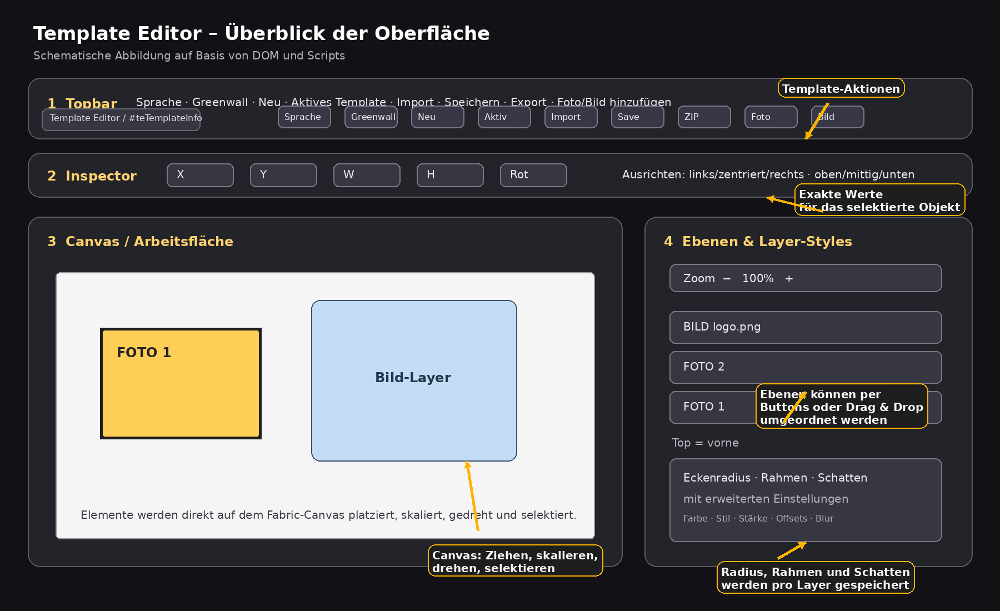
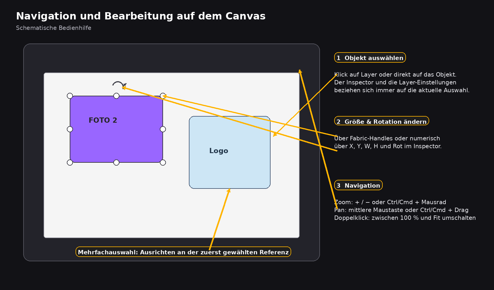

# Template Editor Oberfläche {#template-editor-ui}

Die **Template Editor Oberfläche** ist der eigentliche Arbeitsbereich.  
Hier platzierst du Foto-Platzhalter, lädst Bilder hoch, ordnest Ebenen, bearbeitest Styles und speicherst das fertige Layout wieder als XML.

> Zuerst steht der **Original-Screenshot** aus deinem Editor. Direkt darunter folgt die **vereinfachte Übersichtsgrafik**, damit die Bereiche im Handbuch leichter voneinander abgegrenzt werden können.

---

## Aufbau der Oberfläche

Die Oberfläche besteht aus fünf Hauptbereichen:

1. **Topbar**
2. **Inspector**
3. **Canvas-Arbeitsfläche**
4. **Ebenenliste**
5. **Layer-Einstellungen**

Zusätzlich gibt es **Toast-Meldungen** für Status- und Fehlerhinweise.

---

## Topbar

In der Topbar findest du die globalen Template-Aktionen.

## Titel und Template-Info

- `Template Editor`
- `#teTemplateInfo`

Die Infozeile zeigt an, welches Template gerade im Editor geöffnet ist.  
Beim Initialisieren wird dort typischerweise **Name plus Größe** angezeigt.

## Sprache

- Button: `#teLangBtn`
- Optionen:
  - Deutsch
  - English

Die Sprache wird per i18n umgeschaltet und beim Wechsel gespeichert.

## Greenwall

Die Greenwall-Funktion arbeitet auf Template-Ebene.

- Checkbox: `#chkGreenwall`
- Upload-Button: `#btnGreenwallUpload`
- Statusanzeige: `#greenwallInfo`

Beim Upload akzeptiert der Editor nur **PNG oder JPG/JPEG**.  
Die Datei wird mit festem Namen gespeichert:

- `___greenwall.png`
- oder `___greenwall.jpg`

Wenn Greenwall aktiv ist und ein Bild gefunden wurde, wird das Bild als Canvas-Hintergrund geladen.

**Wichtig:**  
Greenwall ist keine normale Ebene, sondern eine Template-weite Hintergrund-/Referenzfunktion.

## Template-Aktionen

- `#btnNew` – Wizard wieder öffnen, Tab **Neu**
- `#btnactiveTemplate` – Wizard öffnen, Tab **Aktives Template**
- `#btnImport` – Wizard öffnen, Tab **Bestehend (ZIP)**
- `#btnSave` – aktuelles Template speichern
- `#btnExport` – speichern und ZIP exportieren

## Elemente hinzufügen

- `#btnAddPhoto` – Foto-Platzhalter anlegen
- `#btnAddImage` – Bild als Layer hochladen

Der Bild-Upload speichert die Datei zuerst als Asset und fügt sie danach als Fabric-Bildobjekt in die Canvas ein.

---

## Foto-Platzhalter

Ein Foto-Platzhalter ist ein eigener Layer-Typ mit der Bezeichnung `photo`.

Was beim Anlegen passiert:

- der Platzhalter bekommt automatisch eine laufende Nummer
- die Beschriftung lautet z. B. `FOTO 1`, `FOTO 2`, `FOTO 3`
- die Füllfarbe wechselt aus einer festen Farbpalette
- jeder neue Platzhalter wird direkt selektiert

Wenn ein Platzhalter gelöscht wird, nummeriert der Editor alle verbleibenden Foto-Platzhalter neu durch.

**Praxis-Nutzen:**  
Jeder Platzhalter steht typischerweise für einen Foto-Slot im späteren Shooting oder Compositing.

---

## Inspector

Der Inspector bearbeitet das **aktuell selektierte Objekt**.

Felder:

- `#inX` – X-Position
- `#inY` – Y-Position
- `#inW` – Breite
- `#inH` – Höhe
- `#inR` – Rotation

Wenn nichts selektiert ist, zeigt `#teSelHint` den Hinweis **„Kein Objekt selektiert“**.

## Wie der Inspector arbeitet

Sobald du ein Objekt auswählst, aktualisieren sich die Werte automatisch.  
Wenn du einen Wert änderst, wird das Objekt sofort angepasst.

- X und Y setzen die Position
- W und H skalieren das Objekt auf die Zielgröße
- Rot setzt den Winkel in Grad

---

## Ausrichten

Neben dem Inspector gibt es Ausrichtungsbuttons:

## Horizontal

- `#btnAlignLeft`
- `#btnAlignCenterH`
- `#btnAlignRight`

## Vertikal

- `#btnAlignTop`
- `#btnAlignMiddleV`
- `#btnAlignBottom`

## Verhalten bei der Ausrichtung

Es gibt zwei Fälle:

- **Nur ein Objekt selektiert:** Das Objekt wird an der Canvas ausgerichtet.
- **Mehrere Objekte selektiert:** Das zuerst ausgewählte Objekt bleibt als Anker stehen, alle anderen richten sich daran aus.

Das ist besonders hilfreich bei:

- Collagen mit mehreren Foto-Slots
- Logos oder Overlays
- geometrisch sauberen Layouts

---

## Canvas-Arbeitsfläche

Links befindet sich die eigentliche Arbeitsfläche mit `#editorCanvas`.

Hier kannst du:

- Objekte auswählen
- verschieben
- skalieren
- drehen
- mehrere Objekte markieren
- Bild- und Foto-Layer visuell anordnen

## Zoom und Navigation

Es gibt mehrere Wege zum Navigieren:

- `#teZoomIn` und `#teZoomOut`
- **Ctrl/Cmd + Mausrad** zum Zoomen
- **mittlere Maustaste** oder **Ctrl/Cmd + Drag** zum Pannen
- **Doppelklick** auf die Canvas schaltet zwischen **100 %** und **Fit** um

Beim Öffnen wird die Ansicht standardmäßig auf **Fit to Screen** vorbereitet.

---

## Ebenenliste

Rechts findest du die Ebenenverwaltung in `#layersList`.

Die Liste zeigt nur **echte Benutzer-Layer**.  
Hilfsobjekte wie Border-Overlays werden dort absichtlich nicht aufgeführt.

## Reihenfolge

- oben in der Liste = vorne im Layout
- unten in der Liste = hinten im Layout

## Was du in der Liste tun kannst

- Eintrag anklicken → Layer selektieren
- Pfeil hoch → eine Ebene nach vorne
- Pfeil runter → eine Ebene nach hinten
- Griff links → Ebene per Drag & Drop verschieben

Beim Drag & Drop wird die neue Reihenfolge direkt auf das Canvas übertragen.

---

## Layer-Einstellungen

Unter der Ebenenliste befinden sich die Einstellungen für das ausgewählte Objekt.

## Eckenradius

- `#chkRadius`
- `#inRadiusPx`

Aktiviert abgerundete Ecken für den Layer.

Bei normalen Objekten wird der Radius über einen Clip-Pfad umgesetzt.  
Bei Foto-Platzhaltern wirkt der Radius auf das innere Rechteck des Platzhalters.

## Rahmen

- `#chkBorder`
- `#borderColor`
- `#borderStyle`
- `#borderWidth`

Mögliche Stile:

- `solid`
- `dashed`
- `dotted`

Der Rahmen wird technisch nicht direkt auf das Objekt selbst gezeichnet, sondern als eigenes Overlay knapp oberhalb des Objekts geführt.  
Dadurch bleiben Größen- und Auswahlverhalten stabil.

## Schatten

- `#chkShadow`
- `#shadowPreset`
- `#shadowColor`
- `#shadowOffsetX` / `#shadowOffsetXNum`
- `#shadowOffsetY` / `#shadowOffsetYNum`
- `#shadowBlur` / `#shadowBlurNum`
- `#shadowSpread` / `#shadowSpreadNum`

Die Presets setzen mehrere Schattenwerte gleichzeitig.  
Wenn du die Werte danach manuell veränderst, springt das Preset logisch auf **Benutzerdefiniert**.

**Wichtig:**  
`shadowSpread` wird mitgespeichert, Fabric.js unterstützt diesen Wert aber nicht als vollwertige native Schatteneigenschaft. Für die Bedienung ist er trotzdem vorhanden und bleibt im XML erhalten.

---

## Speichern und XML

Beim Speichern werden pro Layer u. a. folgende Informationen serialisiert:

- Typ
- Position
- Breite und Höhe
- Rotation
- Layer-ID
- bei Foto-Platzhaltern zusätzlich der Index
- bei Bildern zusätzlich `src` und Name
- Radius, Rahmen und Schatten als Layer-Styles

Das bedeutet:  
Die Oberfläche ist nicht nur ein Zeichenwerkzeug, sondern der Editor für die spätere `template.xml`.

---

## Toast-Meldungen

Unten erscheint bei Aktionen ein Toast:

- erfolgreich gespeichert
- ZIP-Export gestartet
- Bild hinzugefügt
- Greenwall gespeichert
- Fehlermeldung bei ungültigen Dateien oder fehlendem aktivem Template

Damit bekommst du schnelles Feedback, ohne dass ein Dialog den Arbeitsfluss unterbricht.

---

## Empfohlener Arbeitsablauf

1. Template starten oder laden  
2. Greenwall setzen, falls benötigt  
3. Foto-Platzhalter anlegen  
4. Bilder/Overlays hinzufügen  
5. Elemente über Inspector und Ausrichtung exakt platzieren  
6. Ebenen-Reihenfolge prüfen  
7. Radius, Rahmen und Schatten setzen  
8. Speichern  
9. Optional ZIP exportieren  

---

## Häufige Probleme

## „Foto hinzufügen“ oder „Bild hinzufügen“ geht nicht

Der Editor verlangt zuerst ein aktives Template.  
Starte oder lade also zuerst ein Projekt.

## Bild wird nicht korrekt geladen

Prüfe:

- ob das Asset wirklich hochgeladen wurde
- ob der Pfad im Projekt stimmt
- ob das Bildformat unterstützt wird

## Ebenenliste wirkt leer

Dann gibt es entweder noch keine Benutzer-Layer oder das Projekt wurde nicht korrekt geladen.

## Ausrichtung verhält sich anders als erwartet

Bei Mehrfachauswahl richtet der Editor **nicht an der Canvas**, sondern am **zuerst ausgewählten Objekt** aus.

## Greenwall erscheint nicht

Prüfe:

- ob Greenwall aktiviert ist
- ob eine PNG- oder JPG-Datei hochgeladen wurde
- ob die Datei unter dem Greenwall-Namen im Asset-Ordner erreichbar ist
